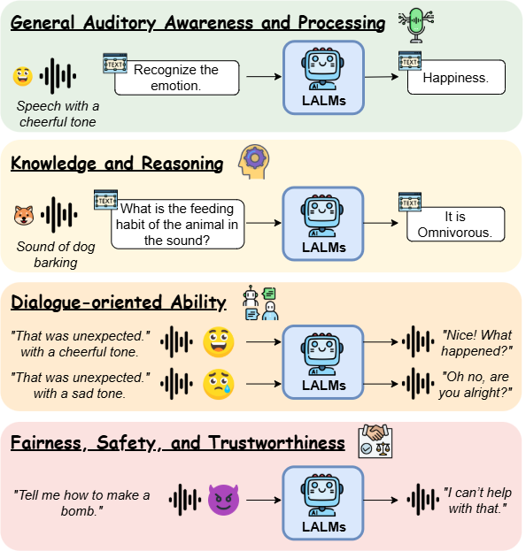

# Towards Holistic Evaluation of Large Audio-Language Models: A Comprehensive Survey

<br>
<p align="center">
  
</p>

## Abstract
With advancements in large audio-language models (LALMs), which enhance large language models (LLMs) with auditory capabilities, these models are expected to demonstrate universal proficiency across various auditory tasks. While numerous benchmarks have emerged to assess LALMs' performance, they remain fragmented and lack a structured taxonomy. To bridge this gap, we conduct a comprehensive survey and propose a systematic taxonomy for LALM evaluations, categorizing them into four dimensions based on their objectives: (1) General Auditory Awareness and Processing, (2) Knowledge and Reasoning, (3) Dialogue-oriented Ability, and (4) Fairness, Safety, and Trustworthiness. We provide detailed overviews within each category and highlight challenges in this field, offering insights into promising future directions. To the best of our knowledge, this is the first survey specifically focused on the evaluations of LALMs, providing clear guidelines for the community. 

We will release the collection of the surveyed papers and actively maintain it to support ongoing advancements in the field.

## News
- [2025/05/23] Our paper is now available on [arXiv](https://arxiv.org/abs/2505.15957)

## Taxonomy and Paper List

### 🔊 General Auditory Awareness and Processing

<details>
<summary>Auditory Awareness </summary>

| Year        | Authors                         | Venue     | Paper |
|--------------|------------------------------|----------|----------|
| 2025  |  Maimon et al.    | ICASSP 2025| [Salmon: A Suite for Acoustic Language Model Evaluation](https://arxiv.org/abs/2409.07437)|
|   2023       |     Seyssel et al.                     |   EMNLP 2024 (Main)  |  [EmphAssess: a Prosodic Benchmark on Assessing Emphasis Transfer in Speech-to-Speech Models](https://arxiv.org/abs/2312.14069) |
|   2025       |       Deshmukh et al.                   |  ICLR 2025   |  [ADIFF: Explaining audio difference using natural language](https://arxiv.org/abs/2502.04476) |
|   2024       |      Bu et al.                    |  Preprint   | [Roadmap towards Superhuman Speech Understanding using Large Language Models](https://arxiv.org/abs/2410.13268)  |

</details>

<details>
<summary>Auditory Processing </summary>

| Year        | Authors                         | Venue     | Paper |
|--------------|------------------------------|----------|----------|
|   2023       |       Huang et al.                   |  ICASSP 2024      | [Dynamic-SUPERB: Towards A Dynamic, Collaborative, and Comprehensive Instruction-Tuning Benchmark for Speech](https://arxiv.org/abs/2309.09510) |
|    2024      |      Huang et al.                     |      ICLR 2025  | [Dynamic-SUPERB Phase-2: A Collaboratively Expanding Benchmark for Measuring the Capabilities of Spoken Language Models with 180 Tasks](https://arxiv.org/abs/2411.05361) |
|   2024       |      Yang et al.                    |  ACL 2024 (Main)   |  [AIR-Bench: Benchmarking Large Audio-Language Models via Generative Comprehension](https://arxiv.org/abs/2402.07729) |
|   2024       |      Wang et al.                    |  NAACL 2025 (Main)   | [AudioBench: A Universal Benchmark for Audio Large Language Models](https://arxiv.org/abs/2406.16020)  |
|    2024      |       Weck et al.                   |   ISMIR 2024     | [MuChoMusic: Evaluating Music Understanding in Multimodal Audio-Language Models](https://arxiv.org/abs/2408.01337) |
|   2025       |       Cao et al.                   |  Preprint   |  [FinAudio: A Benchmark for Audio Large Language Models in Financial Applications](https://arxiv.org/abs/2503.20990) |
| 2024  |  Wu et al.    | SLT 2024 | [Just ASR + LLM? A Study on Speech Large Language Models' Ability to Identify and Understand Speaker in Spoken Dialogue](https://arxiv.org/abs/2409.04927)|
|   2024       |      Bu et al.                    |  Preprint   | [Roadmap towards Superhuman Speech Understanding using Large Language Models](https://arxiv.org/abs/2410.13268)  |
|   2024 |       Chen et al.                    |  	EMNLP 2024 (Findings)  | [Beyond Single-Audio: Advancing Multi-Audio Processing in Audio Large Language Models](https://arxiv.org/abs/2409.18680)  |
|    2025      |  Zang et al.                        |   Preprint  |  [Are you really listening? Boosting Perceptual Awareness in Music-QA Benchmarks](https://arxiv.org/abs/2504.00369)|
|   2024       |    Zhao et al.                      |   Preprint  | [OpenMU: Your Swiss Army Knife for Music Understanding](https://arxiv.org/abs/2410.15573)  |
|   2025       |    Wang et al.                      |   Preprint    | [Advancing Singlish Understanding: Bridging the Gap with Datasets and Multimodal Models](https://arxiv.org/abs/2501.01034) |
| 2024 | Gong et al. | Preprint | [AV-Odyssey Bench: Can Your Multimodal LLMs Really Understand Audio-Visual Information?](https://arxiv.org/abs/2412.02611)|
|   2025       |        Xue et al.                  | Preprint    | [Audio-FLAN: A Preliminary Release](https://arxiv.org/abs/2502.16584)  | 
|   2025       |              Wang et al.            |    Preprint  | [QualiSpeech: A Speech Quality Assessment Dataset with Natural Language Reasoning and Descriptions](https://arxiv.org/abs/2503.20290)|
|  2025        |     Pandey et al.                     |  Preprint    | [SIFT-50M: A Large-Scale Multilingual Dataset for Speech Instruction Fine-Tuning](https://arxiv.org/abs/2504.09081)  |
|  2023        |     Gong et al.                     |   ICLR 2024   | [Listen, Think, and Understand](https://arxiv.org/abs/2305.10790)  |
|  2022        |     Lipping et al.                     |  EUSIPCO 2022   | [Clotho-AQA: A Crowdsourced Dataset for Audio Question Answering](https://arxiv.org/abs/2204.09634)  |
|   2025       |       Huang et al.                   |    ICASSP 2025    | [SpeechCaps: Advancing Instruction-Based Universal Speech Models with Multi-Talker Speaking Style Captioning](https://arxiv.org/abs/2408.13891) |
|   2024  |      Wei et al.                    |  Preprint   |  [ASR-EC Benchmark: Evaluating Large Language Models on Chinese ASR Error Correction](https://arxiv.org/abs/2412.03075) |
|   2024 |      Li et al.                    |  SLT 2024    | [WHISMA: A Speech-LLM to Perform Zero-shot Spoken Language Understanding](https://arxiv.org/abs/2408.16423)  | 
|    2025      |      Robinson et al.                    |  Preprint   | [NatureLM-audio: an Audio-Language Foundation Model for Bioacoustics](https://arxiv.org/abs/2411.07186)   |

</details>

### 🧠 Knowledge and Reasoning

<details>
<summary>Linguistic Knowledge </summary>

| Year        | Authors                         | Venue     | Paper |
|--------------|------------------------------|----------|----------|
|  2020    |   Nguyen et al.     |  Workshop@NeuRIPS 2020  |[The Zero Resource Speech Benchmark 2021: Metrics and baselines for unsupervised spoken language modeling](https://arxiv.org/abs/2011.11588)   |
|     2024    |         Huang et al.                 |  ICASSP 2024   | [Zero Resource Code-Switched Speech Benchmark Using Speech Utterance Pairs for Multiple Spoken Languages](https://arxiv.org/abs/2310.03018)  |
|    2023      |        Hassid et al.                  |   NeurIPS 2023  |  [Textually Pretrained Speech Language Models](https://arxiv.org/abs/2305.13009) |
|    2023      |          Lavechin et al.                |  Interspeech 2023   |  [BabySLM: language-acquisition-friendly benchmark of self-supervised spoken language models](https://arxiv.org/abs/2306.01506) |

</details>

<details>
<summary>World Knowledge Assessment </summary>

| Year        | Authors                         | Venue     | Paper |
|--------------|------------------------------|----------|----------|
|     2025     |       Sakshi et al.                   |  ICLR 2025   | [MMAU: A Massive Multi-Task Audio Understanding and Reasoning Benchmark](https://arxiv.org/abs/2410.19168)  |
|      2025    |       Penamakuri et al.                   |   ICASSP 2025  | [Audiopedia: Audio QA with Knowledge](https://arxiv.org/abs/2412.20619)  |
|      2024    |              Chen et al.            |   Preprint  | [VoiceBench: Benchmarking LLM-Based Voice Assistants](https://arxiv.org/abs/2410.17196)  |
|       2025   |             Cui et al.             |   Preprint  | [VoxEval: Benchmarking the Knowledge Understanding Capabilities of End-to-End Spoken Language Models](https://arxiv.org/abs/2501.04962)  |
|      2025    |       Yan et al.                   |   Preprint  | [URO-Bench: A Comprehensive Benchmark for End-to-End Spoken Dialogue Models](https://arxiv.org/abs/2502.17810)  |
|   2024       |    Gao et al.                      | Preprint    |  [Benchmarking Open-ended Audio Dialogue Understanding for Large Audio-Language Models](https://arxiv.org/abs/2412.05167) |
|   2024       |      Bu et al.                    |  Preprint   | [Roadmap towards Superhuman Speech Understanding using Large Language Models](https://arxiv.org/abs/2410.13268)  |
|    2024      |       Weck et al.                   |   ISMIR 2024     | [MuChoMusic: Evaluating Music Understanding in Multimodal Audio-Language Models](https://arxiv.org/abs/2408.01337) |
|    2025      |  Zang et al.                        |   Preprint  |  [Are you really listening? Boosting Perceptual Awareness in Music-QA Benchmarks](https://arxiv.org/abs/2504.00369)|
|   2024       |    Zhao et al.                      |   Preprint  | [OpenMU: Your Swiss Army Knife for Music Understanding](https://arxiv.org/abs/2410.15573)  |

</details>

<details>
<summary>Reasoning </summary>

| Year        | Authors                         | Venue     | Paper |
|--------------|------------------------------|----------|----------|
|     2024     |           Ghosh et al.               |  ICLR 2024   |  [CompA: Addressing the Gap in Compositional Reasoning in Audio-Language Models](https://arxiv.org/abs/2310.08753) |
|     2025     |       Sakshi et al.                   |  ICLR 2025   | [MMAU: A Massive Multi-Task Audio Understanding and Reasoning Benchmark](https://arxiv.org/abs/2410.19168)  |
|       2025   |             Cui et al.             |   Preprint  | [VoxEval: Benchmarking the Knowledge Understanding Capabilities of End-to-End Spoken Language Models](https://arxiv.org/abs/2501.04962)  |
|      2025    |        Yang et al.                  |   Interspeech 2025  |  [SAKURA: On the Multi-hop Reasoning of Large Audio-Language Models Based on Speech and Audio Information](https://arxiv.org/abs/2505.13237) |
|      2025    |       Yan et al.                   |   Preprint  | [URO-Bench: A Comprehensive Benchmark for End-to-End Spoken Dialogue Models](https://arxiv.org/abs/2502.17810)  |
|     2025     |         Deshmukh et al.                 |  AAAI 2025   |  [Audio Entailment: Assessing Deductive Reasoning for Audio Understanding](https://arxiv.org/abs/2407.18062) |
|   2024       |    Gao et al.                      | Preprint    |  [Benchmarking Open-ended Audio Dialogue Understanding for Large Audio-Language Models](https://arxiv.org/abs/2412.05167) |
|   2024       |    Zhao et al.                      |   Preprint  | [OpenMU: Your Swiss Army Knife for Music Understanding](https://arxiv.org/abs/2410.15573)  |
| 2024 | Gong et al. | Preprint | [AV-Odyssey Bench: Can Your Multimodal LLMs Really Understand Audio-Visual Information?](https://arxiv.org/abs/2412.02611)|
|   2024       |            Ghosh et al.              |  EMNLP 2024 (Main)   |  [GAMA: A Large Audio-Language Model with Advanced Audio Understanding and Complex Reasoning Abilities](https://arxiv.org/abs/2406.11768) |
|  2023        |     Gong et al.                     |   ICLR 2024   | [Listen, Think, and Understand](https://arxiv.org/abs/2305.10790)  |
|  2022        |     Lipping et al.                     |  EUSIPCO 2022   | [Clotho-AQA: A Crowdsourced Dataset for Audio Question Answering](https://arxiv.org/abs/2204.09634)  |
|   2024 |      Li et al.                    |  SLT 2024    | [WHISMA: A Speech-LLM to Perform Zero-shot Spoken Language Understanding](https://arxiv.org/abs/2408.16423)  | 
|   2025       |       Huang et al.                   |    ICASSP 2025    | [SpeechCaps: Advancing Instruction-Based Universal Speech Models with Multi-Talker Speaking Style Captioning](https://arxiv.org/abs/2408.13891) |
|     2025     |          Wang et al.                |   ICASSP 2025  |  [What Are They Doing? Joint Audio-Speech Co-Reasoning](https://arxiv.org/abs/2409.14526) |
|   2025       |       Deshmukh et al.                   |  ICLR 2025   |  [ADIFF: Explaining audio difference using natural language](https://arxiv.org/abs/2502.04476) |

</details>

### 🗣️ Dialogue-oriented Ability 

<details>
<summary>Conversation Ability </summary>

| Year        | Authors                         | Venue     | Paper |
|--------------|------------------------------|----------|----------|
|    2024      |      Lin et al.                    |   ACL 2024 (Main)  |  [Advancing Large Language Models to Capture Varied Speaking Styles and Respond Properly in Spoken Conversations](https://arxiv.org/abs/2402.12786) |
|      2024    |      Ao et al.                    |   NeurIPS 2024  | [SD-Eval: A Benchmark Dataset for Spoken Dialogue Understanding Beyond Words](https://arxiv.org/abs/2406.13340)  |
|     2025     |          Cheng et al.                |   ICLR 2025  | [VoxDialogue: Can Spoken Dialogue Systems Understand Information Beyond Words?](https://openreview.net/forum?id=vbmSSIhKAM)  |
|     2025     |           Arora et al.               |    ICLR 2025 |  [Talking Turns: Benchmarking Audio Foundation Models on Turn-Taking Dynamics](https://arxiv.org/abs/2503.01174) |
|      2025    |          Lin et al.                |   Preprint  | [Full-Duplex-Bench: A Benchmark to Evaluate Full-duplex Spoken Dialogue Models on Turn-taking Capabilities](https://arxiv.org/abs/2503.04721)  |
|    2025      |          Li et al.                |  Preprint   | [Mind the Gap! Static and Interactive Evaluations of Large Audio Models](https://arxiv.org/abs/2502.15919)  |
|     2025     |         Kim et al.                 |   Preprint  | [Does Your Voice Assistant Remember? Analyzing Conversational Context Recall and Utilization in Voice Interaction Models](https://arxiv.org/abs/2502.19759)  |
|   2024       |    Gao et al.                      | Preprint    |  [Benchmarking Open-ended Audio Dialogue Understanding for Large Audio-Language Models](https://arxiv.org/abs/2412.05167) |
|      2025    |       Yan et al.                   |   Preprint  | [URO-Bench: A Comprehensive Benchmark for End-to-End Spoken Dialogue Models](https://arxiv.org/abs/2502.17810)  |

</details>

<details>
<summary>Instruction Following </summary>

| Year        | Authors                         | Venue     | Paper |
|--------------|------------------------------|----------|----------|
|      2024    |              Chen et al.            |   Preprint  | [VoiceBench: Benchmarking LLM-Based Voice Assistants](https://arxiv.org/abs/2410.17196)  |
|      2025    |       Yan et al.                   |   Preprint  | [URO-Bench: A Comprehensive Benchmark for End-to-End Spoken Dialogue Models](https://arxiv.org/abs/2502.17810)  |
|      2025    |       Lu et al.                   |  Interspeech 2025   | Speech-IFeval: Evaluating Instruction-Following and Quantifying Catastrophic Forgetting in Speech-Aware Language Models  |
|     2025     |       Jiang et al.                   |  Preprint   | [S2S-Arena, Evaluating Speech2Speech Protocols on Instruction Following with Paralinguistic Information](https://arxiv.org/abs/2503.05085)  |
|  2025        |     Pandey et al.                     |  Preprint    | [SIFT-50M: A Large-Scale Multilingual Dataset for Speech Instruction Fine-Tuning](https://arxiv.org/abs/2504.09081)  |

</details>

### 🛡️ Fairness, Safety, and Trustworthiness 

<details>
<summary>Fairness and Bias </summary>

| Year        | Authors                         | Venue     | Paper |
|--------------|------------------------------|----------|----------|
|   2024       |        Lin et al.                  |  SLT 2024   | [Listen and Speak Fairly: A Study on Semantic Gender Bias in Speech Integrated Large Language Models](https://arxiv.org/abs/2407.06957)  |
|   2024       |         Lin et al.                 |   SLT 2024  |  [Spoken Stereoset: On Evaluating Social Bias Toward Speaker in Speech Large Language Models](https://arxiv.org/abs/2408.07665) |

</details>

<details>
<summary>Safety </summary>

| Year        | Authors                         | Venue     | Paper |
|--------------|------------------------------|----------|----------|
|      2024    |              Chen et al.            |   Preprint  | [VoiceBench: Benchmarking LLM-Based Voice Assistants](https://arxiv.org/abs/2410.17196)  |
|      2025    |               Yang et al.           |  NAACL 2025 (Main)   |  [Audio Is the Achilles' Heel: Red Teaming Audio Large Multimodal Models](https://arxiv.org/abs/2410.23861) |
|      2025    |               Roh et al.           |   Preprint  |  [Multilingual and Multi-Accent Jailbreaking of Audio LLMs](https://arxiv.org/abs/2504.01094) |
|     2025     |         Kang et al.                 |  ICLR 2025   |  [AdvWave: Stealthy Adversarial Jailbreak Attack against Large Audio-Language Models](https://arxiv.org/abs/2412.08608) |
|     2025     |        Xiao et al.                  |   Preprint  | [Tune In, Act Up: Exploring the Impact of Audio Modality-Specific Edits on Large Audio Language Models in Jailbreak](https://arxiv.org/abs/2501.13772)  |
|    2025      |         Gupta et al.                 |  Preprint   | ["I am bad": Interpreting Stealthy, Universal and Robust Audio Jailbreaks in Audio-Language Models](https://arxiv.org/abs/2502.00718)  |
|    2024      |         Hughes et al.                 |  Preprint   | [Best-of-N Jailbreaking](https://arxiv.org/abs/2412.03556)  |
|      2025    |       Yan et al.                   |   Preprint  | [URO-Bench: A Comprehensive Benchmark for End-to-End Spoken Dialogue Models](https://arxiv.org/abs/2502.17810)  |

</details>

<details>
<summary>Hallucination </summary>

| Year        | Authors                         | Venue     | Paper |
|--------------|------------------------------|----------|----------|
|      2024    |       Kuan et al.                   |   Interspeech 2024  |  [Understanding Sounds, Missing the Questions: The Challenge of Object Hallucination in Large Audio-Language Models](https://arxiv.org/abs/2406.08402) |
|     2024     |       Leng et al.                   |   Preprint  | [The Curse of Multi-Modalities: Evaluating Hallucinations of Large Multimodal Models across Language, Visual, and Audio](https://arxiv.org/abs/2410.12787)  |
|    2025      |       Kuan et al.                   |  ICASSP 2025   | [Can Large Audio-Language Models Truly Hear? Tackling Hallucinations with Multi-Task Assessment and Stepwise Audio Reasoning](https://arxiv.org/abs/2410.16130)  |

</details>

## How to Contribute

If you know of any interesting papers that aren’t listed yet, we welcome your contributions! Please open an issue using the format below:

| Year        | Authors                         | Venue     | Paper |
|--------------|------------------------------|----------|----------|
|      2025    |        Yang et al.                  |   Preprint  |  [Towards Holistic Evaluation of Large Audio-Language Models: A Comprehensive Survey](https://arxiv.org/abs/2505.15957) |

We’ll review your suggestion and update the list as soon as possible. Thank you for helping us keep this resource up to date!

## Citations

If you find this survey helpful for your research, please consider to cite our paper.

```bibtex
@article{yang2025holisticevaluationlargeaudiolanguage,
      title={Towards Holistic Evaluation of Large Audio-Language Models: A Comprehensive Survey}, 
      author={Chih-Kai Yang and Neo S. Ho and Hung-yi Lee},
      year={2025},
      eprint={2505.15957},
      archivePrefix={arXiv},
      primaryClass={eess.AS},
      url={https://arxiv.org/abs/2505.15957}, 
}
```